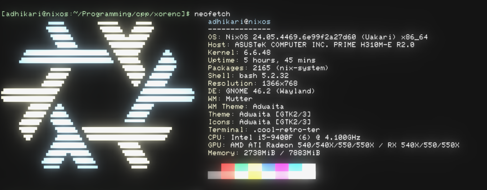

# XOR File Encryptor / Decryptor Tool

### Source Code

```cpp
# include <bits/stdc++.h>
# include <fstream>
# include <stdexcept>

# define MAX_ARG_LENGTH 300

bool secure_args(int count_args, char* args[]) {

   for (int i = 1; i < count_args; i++) {
      if (std::strlen(args[i]) > MAX_ARG_LENGTH) {
         return 0;
      }
   }

   return 1;

}

size_t hash_digest(std::string data) {

   std::hash<std::string> hash_fun;

   return hash_fun(data);

}  // Limitation of using std::hash that its not cryptographically secure. Meaning different systems/environments will generate different hashes.

// User Authentication
bool authenticate() {

   std::string passkey;

   std::cout<<"Enter Password: ";
      std::cin>>passkey;
         std::cout<<std::endl;

   std::size_t digest = hash_digest(passkey);

   if (digest == 10072368718624887297) {   // password: averystrongpassword:10072368718624887297.

      return true;

   } else {

      std::cout<<"Password Digest: "<<std::to_string(digest)<<"\n"<<std::endl;
      return false;

      }

}

std::string XOR(const std::string& text, const std::string& key) {
    
    std::string result = text;
    size_t keyLength = key.length();

    for (size_t i = 0; i < text.length() - 1; i++) {  // text.length() - 1 to avoid encoding the escape character /0
    
       result[i] ^= key[i % keyLength];

    }

    return result;

}

std::string read_file(std::string& file_path) {

   std::fstream target_file;
   target_file.open(file_path, std::ios::in);
   std::string output = "";
   
   if (target_file.is_open()) {

      std::string line;

      while(getline(target_file, line)) {

         output = output + line + "\n";

      }

   } else {

      throw std::runtime_error("\nERROR: Could Not Open File " + file_path + ".\nHint: Check if path is correct or if the file exists or not.\nCheck file permissions.");

   }

   target_file.close();
   return output;

}

void write_file(std::string& file_path, std::string& contents) {

   std::fstream target_file;
   target_file.open(file_path, std::ios::out);

   if (target_file.is_open()) {

      target_file << contents;

   } else {

      throw std::runtime_error("\nERROR: Could Not Open File " + file_path + ".\nHint: Check if path is correct or if the file exists or not.\nCheck file permissions.");

   }

   target_file.close(); 
   return ;

}

void encrypt(std::string& ip_file_path, std::string& op_file_path, std::string& key_file_path) {

   std::string ip_content = read_file(ip_file_path);

   if (ip_content.empty()) {

      std::cout<<"ERROR: Empty File "<<ip_file_path<<" Provided.\nHint: Cannot perform encryption on a empty file."<<std::endl;
      return;

   }

   std::string key = read_file(key_file_path);

   std::string cypher_text = XOR(ip_content, key);

   size_t digest = hash_digest(ip_content);
   std::string str_digest = std::to_string(digest);

   cypher_text = str_digest + "\n" + cypher_text;

   write_file(op_file_path, cypher_text);

   std::cout<<"Encryption Succesful!\nNOTE: Do not edit the output file to maintain integrity and avoid data loss."<<std::endl;

   return; 

}

void decrypt(std::string target_file_path, std::string key_file_path) {

    std::fstream file(target_file_path);
    if (!file) {

        std::cerr<<"ERROR: Cannot Open File "<<target_file_path<<".\nHint: Check if the file location provided is correct or check the file permissions."<<std::endl;
        return;
    
    }

    std::string stored_digest;
    std::getline(file, stored_digest);  // Extract first line (hash)

    std::string encrypted_content((std::istreambuf_iterator<char>(file)), std::istreambuf_iterator<char>());   // To start reading after the first line
    file.close();

    std::string key = read_file(key_file_path);
    std::string decrypted_content = XOR(encrypted_content, key);

    size_t digest = hash_digest(decrypted_content);
    
    // Validate Integrity
    if (std::to_string(digest) == stored_digest) {

        std::cout << "Integrity check passed. File successfully decrypted." << std::endl;
        write_file(target_file_path, decrypted_content);

    } else {
    
       std::cerr << "Integrity check failed! File may be tampered with." << std::endl;

    }

    return;
}

int main(int argc, char* argv[]) {

   // argv[ ./EXECUTABLE.exe, INPUT_FILE_PATH, OUTPUT_FILE_PATH, KEY_FILE_PATH ]

   if (argc > 4) {

      std::cout<<"ERROR: Too Many Command Line Arguements.\n\nFix: Order of arguemets [INPUT_FILE-NAME OUTPUT_FILE-NAME ENCRYPTION_KEY_FILE\n";

   } else if (argc < 4) {

      std::cout<<"ERROR: Insufficient Command Line Arguements.\n\nFix: Order of arguemets [INPUT_FILE-NAME OUTPUT_FILE-NAME ENCRYPTION_KEY_FILE\n";

   } else {

      std::string input_file = argv[1];
      std::string output_file = argv[2];
      std::string xor_key = argv[3];

      if (secure_args(argc, argv)) {

         if (authenticate()) {

            std::string option = "";   // std::string to avoid Overflows and Underflows

            while (1) {

               std::cout<<"Choose an option\n\t1) Encrypt\n\t2) Decrypt\n\t3) Exit\n\n>";
                  std::cin>>option;
                     std::cout<<std::endl;
              
               if (option == "1") {

                  encrypt(input_file, output_file, xor_key);
                  
                  return 0;

               } else if (option == "2") {

                  decrypt(output_file, xor_key);

                  return 0;

               } else if (option == "3") {

                 return 0; 

               } else {

                  std::cout<<"ERROR: Invalid Choice.\nHint: Type \"1\" for encryption, Type \"2\" for decryption, and Type \"3\" for exiting the program\n"<<std::endl;;

               }

            }

         } else {

            std::cout<<"AUTH FALIURE: Incorrect Authentication Password\nHint: The hash function used might not generate same hash across different environemtns so kindly add your hash generated above to the authenticate() function to make the program work as intended. Sorry for the inconvience.\n"<<std::endl;

            return 0;

         }

      } else {

         std::cout<<"ERROR: Too Long Arguements Provided.\nHint: Please consider shifting the files closer to the program executable.\n"<<std::endl;         

      }

   }

   return 0;

}

```

### Development Environment



### Directory Hierarchical

![[Pasted image 20250331201721.png]]

- `input/ip.txt` : File with the input text
	![[Pasted image 20250331202126.png]]

- `output/op.txt`: File with the output txt
	![[Pasted image 20250331202211.png]]

- `key/key.txt` : File with the XOR key
	![[Pasted image 20250331202245.png]]

- `main` : Main executable binary
- `main.cpp` : Source code
### PoC

##### Output File Not Tampered
![[Screenshot from 2025-03-31 20-25-57.png]]
##### Output File Tampered

- Original `op.txt` 
	![[Pasted image 20250331215634.png]]

- Tampered `op.txt`
	![[Pasted image 20250331215706.png]]

![[Pasted image 20250331215737.png]]

### Important Note
The `std::hash` used is not recommenced since it records more collisions when compared to SHA-256. Also the library will not generate same hash for different environments or systems, so kindly attempt to enter the password `"averystrongpassword"` when prompted for the password, if it does'nt work, copy the hash generated and paste it in the `cmp` instruction on the right hand side. 

I could've used SHA-256 using the `openssl/sha.h` import, unfortunately my local environment was not able to detect the library even after installing the dependencies.

Thank You for understanding.
